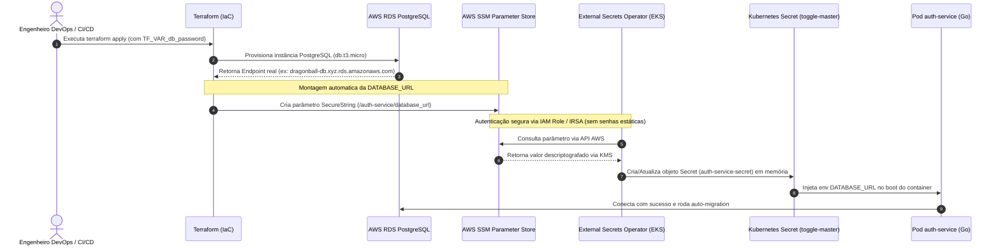

# 🏗️ Arquitetura de Automação de Segredos, IaC e Código como Única Fonte da Verdade

> **Contexto:** FIAP Postech — Tech Challenge Fase 3  
> **Tema:** DevSecOps, Infraestrutura como Código (IaC), Gestão Segura de Credenciais e Automação Ponta a Ponta (Zero ClickOps).

---

## 1. O Princípio: "Código como Única Fonte da Verdade"

No desenvolvimento moderno de software e operações em nuvem (Cloud-Native), vigora a regra de **Zero ClickOps** (nenhuma ação manual no console da AWS). 

* Se um recurso for criado ou editado manualmente pelo painel da AWS, cria-se o chamado **Configuration Drift** (a infraestrutura real diverge do código versionado).
* Se a infraestrutura for destruída (`terraform destroy`), o sistema deve ser capaz de ser **reconstruído do zero com um único comando (`terraform apply`)**, incluindo a criação de bancos, cálculo de endpoints, injeção de parâmetros criptografados e provisionamento no Kubernetes.

---

## 2. O Desafio dos Recursos Dinâmicos

Como a aplicação no Kubernetes sabe como conectar no banco de dados se o endereço do RDS (`dragonball-db.c12345.us-east-2.rds.amazonaws.com`) só existe **depois** que a AWS provisiona o banco?

### ❌ A Abordagem Incorreta (ClickOps Manual):
1. Rodar o Terraform para criar o RDS.
2. Entrar no painel da AWS, copiar o endpoint gerado.
3. Criar manualmente um parâmetro no SSM ou colar a connection string no Git.
* **Problema:** Quebra a automação, expõe credenciais e impede a execução contínua via CI/CD.

### ✅ A Abordagem Correta (IaC com Valores Computados):
O Terraform gerencia um **Grafo de Dependências Acíclico (DAG)**. Ele provisiona o banco primeiro, captura o endpoint gerado em tempo de execução (`module.rds.db_endpoint`) e injeta no **AWS SSM Parameter Store** automaticamente.

---

## 3. Fluxo de Execução Ponta a Ponta



---

## 4. Implementação Prática no Código

### A. No Terraform (`terraform/main.tf`)
Nenhum endpoint ou connection string é escrito manualmente. O Terraform calcula tudo:

```hcl
# 1. Provisionamento do Banco
module "rds" {
  source                = "./modules/rds"
  project_name          = var.project_name
  vpc_id                = module.network.vpc_id
  subnet_ids            = module.network.private_subnet_ids
  eks_security_group_id = module.eks.cluster_security_group_id
  db_instance_class     = "db.t3.micro"
  db_username           = var.db_username
  db_password           = var.db_password
}

# 2. Injeção Automática no AWS SSM Parameter Store
resource "aws_ssm_parameter" "database_url" {
  name        = "/${var.project_name}/prod/auth-service/database_url"
  description = "Connection string gerada automaticamente pelo Terraform"
  type        = "SecureString"

  # Constrói a connection string dinamicamente usando outputs do RDS
  value = "postgres://${module.rds.db_username}:${var.db_password}@${module.rds.db_endpoint}/${module.rds.db_name}?sslmode=require"

  tags = {
    Environment = "prod"
    ManagedBy   = "Terraform"
  }

  depends_on = [module.rds]
}
```

---

### B. No Repositório GitOps / Kustomize (`gitops/apps/auth-service/base/externalsecret.yml`)
O Git versiona apenas a intenção (onde buscar o segredo), mantendo o código 100% público e seguro:

```yaml
apiVersion: external-secrets.io/v1beta1
kind: ExternalSecret
metadata:
  name: auth-service-secrets
  namespace: toggle-master
spec:
  refreshInterval: 1h
  secretStoreRef:
    name: aws-ssm-store
    kind: ClusterSecretStore
  target:
    name: auth-service-secret
    creationPolicy: Owner
  data:
    - secretKey: DATABASE_URL
      remoteRef:
        key: /auth-service/database_url
```

---

## 5. Como a Senha Mestre é Injetada com Segurança

A única informação que o sistema precisa receber do operador é a senha mestre inicial. Ela nunca é commitada no Git:

1. **Em Ambiente Local de Desenvolvimento:**
   ```bash
   export TF_VAR_db_password="MinhaSenhaForteSuperSegura123!"
   terraform apply
   ```
2. **Na Pipeline Automatizada (GitHub Actions CI/CD):**
   ```yaml
   - name: Terraform Apply
     run: terraform apply -auto-approve
     env:
       TF_VAR_db_password: ${{ secrets.PROD_DB_PASSWORD }}
       AWS_ACCESS_KEY_ID: ${{ secrets.AWS_ACCESS_KEY_ID }}
       AWS_SECRET_ACCESS_KEY: ${{ secrets.AWS_SECRET_ACCESS_KEY }}
   ```

---

## 6. Comparativo: ClickOps vs. Automação IaC Pura

| Critério de Avaliação | Abordagem Manual (ClickOps) | Automação IaC + ESO (Implementada) |
| :--- | :--- | :--- |
| **Rastreabilidade (Git)** | ❌ Nenhuma (ações perdidas no console) | 🟢 100% versionada e auditável |
| **Segurança de Credenciais** | ❌ Alto risco de vazamento em logs/código | 🟢 Criptografia KMS + Tokens OIDC temporários |
| **Tempo de Recuperação de Desastre** | ❌ Horas (configuração manual propensa a erros) | 🟢 Minutos (1 único `terraform apply`) |
| **Conformidade com a FIAP** | ❌ Não atende aos requisitos da Fase 3 | 🟢 Padrão Ouro de Avaliação Acadêmica/Mercado |

---

## 7. Resumo para a Apresentação do Projeto
> *"Nossa infraestrutura foi desenhada seguindo o padrão de **Infraestrutura Imutável** e **GitOps Puro**. Nenhuma credencial trafega em texto plano pelo repositório Git. O Terraform é o orquestrador responsável por provisionar a base relacional, computar as URLs de conexão em tempo de execução e registrá-las de forma criptografada no AWS SSM Parameter Store. No cluster Kubernetes, o External Secrets Operator (ESO) consome essas credenciais de maneira contínua através de autenticação IAM/OIDC (IRSA), garantindo segurança máxima e automação completa de ponta a ponta."*
