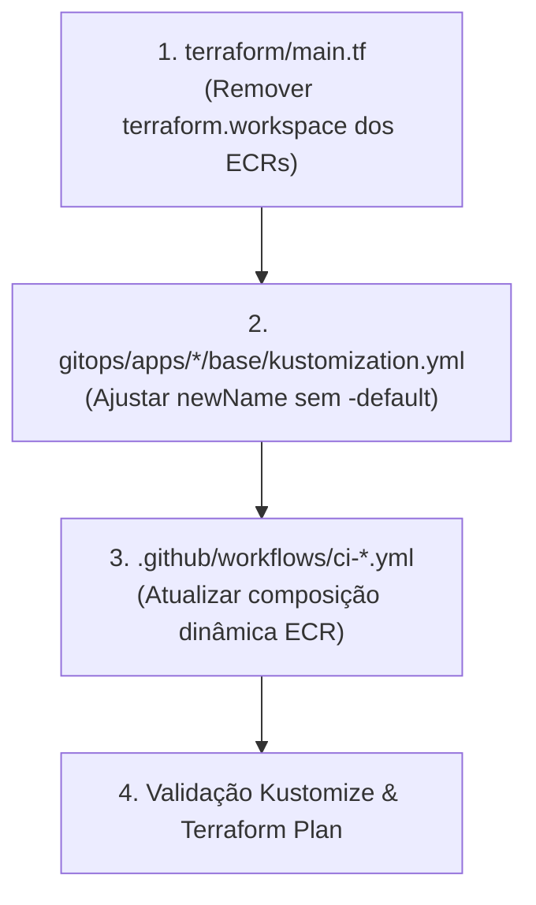

# 📋 Plano de Implementação: Remoção de `${terraform.workspace}` e Automação Dinâmica do ECR

> **Projeto:** FIAP Postech — Tech Challenge Fase 3 (ToggleMaster)  
> **Status:** Proposto / Em Planejamento

---

## 🎯 1. Descrição do Objetivo
1. **Terraform:** Localizar e remover o sufixo `-${terraform.workspace}` (que concatena `-default` em tudo) na criação dos 5 repositórios ECR em `terraform/main.tf` (e no módulo S3 opcional), padronizando os nomes para `${var.project_name}/${service_name}`.
2. **GitOps / Kustomize:** Atualizar os manifestos base de cada microsserviço (`gitops/apps/*/base/kustomization.yml`) para refletir o novo padrão de imagem ECR sem `-default`.
3. **CI/CD GitHub Actions:** Automatizar a resolução do repositório ECR nos 5 workflows (`.github/workflows/ci-*.yml`), eliminando valores hardcoded repetidos e derivando `${PROJECT_NAME}/${SERVICE_DIR}` de forma limpa e dinâmica.

---

## 🔍 2. Diagnóstico e Mapeamento dos Arquivos Afetados

### A. No Terraform (`terraform/`):
- **[`terraform/main.tf`](file:///home/brsantos/projects/fiap/FASE3/terraform/main.tf#L137-L143):**
  ```hcl
  # ANTES:
  module "ecr" {
    source = "./modules/ecr"
    repository_names = [
      "${var.project_name}/auth-service-${terraform.workspace}",
      "${var.project_name}/flag-service-${terraform.workspace}",
      "${var.project_name}/targeting-service-${terraform.workspace}",
      "${var.project_name}/evaluation-service-${terraform.workspace}",
      "${var.project_name}/analytics-service-${terraform.workspace}"
    ]
  }

  # DEPOIS:
  module "ecr" {
    source = "./modules/ecr"
    repository_names = [
      "${var.project_name}/auth-service",
      "${var.project_name}/flag-service",
      "${var.project_name}/targeting-service",
      "${var.project_name}/evaluation-service",
      "${var.project_name}/analytics-service"
    ]
  }
  ```
- **[`terraform/modules/s3/main.tf`](file:///home/brsantos/projects/fiap/FASE3/terraform/modules/s3/main.tf#L2):** Remover `-${terraform.workspace}` do bucket name.

---

### B. No Kustomize (`gitops/apps/*/base/kustomization.yml`):
- `gitops/apps/auth-service/base/kustomization.yml` ➔ `.../super-app-v1/auth-service`
- `gitops/apps/flag-service/base/kustomization.yml` ➔ `.../super-app-v1/flag-service`
- `gitops/apps/targeting-service/base/kustomization.yml` ➔ `.../super-app-v1/targeting-service`
- `gitops/apps/evaluation-service/base/kustomization.yml` ➔ `.../super-app-v1/evaluation-service`
- `gitops/apps/analytics-service/base/kustomization.yml` ➔ `.../super-app-v1/analytics-service`

---

### C. Nas Pipelines CI/CD (`.github/workflows/ci-*.yml`):
Em vez de declarar `ECR_REPOSITORY: ${{ secrets.PROJECT_NAME }}/<service>-default`, a pipeline passa a compor a URL dinamicamente via `${{ env.PROJECT_NAME }}/${{ env.SERVICE_DIR }}` nos steps de Docker build, Trivy scan, push ECR e atualização do Kustomize.

---

## 🏗️ 3. Fluxo de Execução



---

## 🧪 4. Plano de Verificação

1. `terraform -chdir=terraform validate` para validar sintaxe do Terraform.
2. `kubectl kustomize gitops/overlays/prod` para validar compilação sem erros do Kustomize.
3. Checagem de consistência de regex em todos os workflows para garantir que nenhum `-default` ou `terraform.workspace` residual permaneça esquecido.
