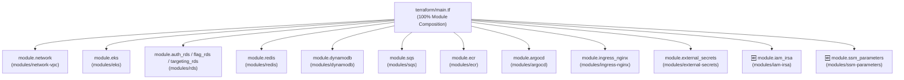

# 📐 Plano de Implementação: Modularização 100% do Terraform (Clean Architecture)

Este documento detalha o plano de refatoração para transformar a infraestrutura como código (IaC) do projeto no padrão ouro de arquitetura Terraform (*Pure Composition*), eliminando todos os blocos `resource` soltos do arquivo raiz `terraform/main.tf` e organizando-os em módulos reutilizáveis e componentizados, com blocos nativos `moved` para garantir zero recriação de recursos e zero downtime.

---

## 🎯 1. Objetivo & Contexto

Atualmente, o arquivo [main.tf](file:///home/brsantos/projects/fiap/FASE3/terraform/main.tf) orquestra 10 módulos (`network-vpc`, `eks`, `rds` (x3), `redis`, `dynamodb`, `sqs`, `ecr`, `argocd`, `ingress-nginx`, `external-secrets`), porém ainda contém blocos `resource` soltos:
- **Políticas e Roles de IAM/IRSA** para comunicação do EKS/Pods com SQS e DynamoDB (`aws_iam_role`, `aws_iam_role_policy`).
- **Parâmetros Criptografados no AWS SSM Parameter Store** (`aws_ssm_parameter`) para os 5 microsserviços.

### Meta:
1. Criar o módulo [modules/iam-irsa](file:///home/brsantos/projects/fiap/FASE3/terraform/modules/iam-irsa).
2. Criar o módulo [modules/ssm-parameters](file:///home/brsantos/projects/fiap/FASE3/terraform/modules/ssm-parameters).
3. Atualizar [terraform/main.tf](file:///home/brsantos/projects/fiap/FASE3/terraform/main.tf) para conter **exclusivamente blocos `module`** (100% modularizado).
4. Adicionar blocos `moved` para mapear os recursos existentes do estado local (`terraform.tfstate`) sem destruir nem recriar nenhum componente na AWS.
5. Atualizar [terraform/outputs.tf](file:///home/brsantos/projects/fiap/FASE3/terraform/outputs.tf).

---

## 🏗️ 2. Arquitetura Alvo do Terraform



---

## 🔍 3. User Review Required

> [!IMPORTANT]
> **Zero Downtime & State Migration:**
> Utilizaremos blocos `moved` do Terraform 1.1+. Ao rodar `terraform plan`, o Terraform reconhecerá automaticamente a alteração de endereço no estado sem agendar `destroy` ou `recreate` para nenhum recurso na AWS.

---

## 📋 4. Proposta Detalhada de Alterações

---

### Componente 1: Novo Módulo `modules/iam-irsa`

#### [NEW] `terraform/modules/iam-irsa/variables.tf`
```hcl
variable "project_name" {
  description = "Prefixo padrão do projeto"
  type        = string
}

variable "node_role_name" {
  description = "Nome da IAM Role dos nós gerenciados do EKS"
  type        = string
}

variable "sqs_queue_arn" {
  description = "ARN da fila SQS para políticas de envio e consumo"
  type        = string
}

variable "dynamodb_table_arn" {
  description = "ARN da tabela DynamoDB para política do analytics-service"
  type        = string
}

variable "oidc_provider_arn" {
  description = "ARN do OIDC Provider do cluster EKS"
  type        = string
}

variable "oidc_provider_url" {
  description = "URL do OIDC Provider do cluster EKS"
  type        = string
}
```

#### [NEW] `terraform/modules/iam-irsa/main.tf`
```hcl
# Permissão IAM para os nós do EKS enviarem mensagens para a fila SQS
resource "aws_iam_role_policy" "eks_node_sqs" {
  name = "${var.project_name}-node-sqs-policy"
  role = var.node_role_name

  policy = jsonencode({
    Version = "2012-10-17"
    Statement = [
      {
        Effect = "Allow"
        Action = [
          "sqs:SendMessage",
          "sqs:GetQueueUrl",
          "sqs:GetQueueAttributes"
        ]
        Resource = var.sqs_queue_arn
      }
    ]
  })
}

# IAM Role (IRSA) para o evaluation-service enviar mensagens para o SQS
resource "aws_iam_role" "evaluation_sqs_irsa" {
  name = "${var.project_name}-evaluation-sqs-role"

  assume_role_policy = jsonencode({
    Version = "2012-10-17"
    Statement = [
      {
        Effect = "Allow"
        Principal = {
          Federated = var.oidc_provider_arn
        }
        Action = "sts:AssumeRoleWithWebIdentity"
        Condition = {
          StringEquals = {
            "${replace(var.oidc_provider_url, "https://", "")}:sub" = "system:serviceaccount:toggle-master:evaluation-service-sa"
            "${replace(var.oidc_provider_url, "https://", "")}:aud" = "sts.amazonaws.com"
          }
        }
      }
    ]
  })
}

resource "aws_iam_role_policy" "evaluation_sqs_policy" {
  name = "${var.project_name}-evaluation-sqs-policy"
  role = aws_iam_role.evaluation_sqs_irsa.name

  policy = jsonencode({
    Version = "2012-10-17"
    Statement = [
      {
        Effect = "Allow"
        Action = [
          "sqs:SendMessage",
          "sqs:GetQueueUrl",
          "sqs:GetQueueAttributes"
        ]
        Resource = var.sqs_queue_arn
      }
    ]
  })
}

# IAM Role (IRSA) para o analytics-service ler do SQS e gravar no DynamoDB
resource "aws_iam_role" "analytics_sqs_dynamodb_irsa" {
  name = "${var.project_name}-analytics-irsa-role"

  assume_role_policy = jsonencode({
    Version = "2012-10-17"
    Statement = [
      {
        Effect = "Allow"
        Principal = {
          Federated = var.oidc_provider_arn
        }
        Action = "sts:AssumeRoleWithWebIdentity"
        Condition = {
          StringEquals = {
            "${replace(var.oidc_provider_url, "https://", "")}:sub" = "system:serviceaccount:toggle-master:analytics-service-sa"
            "${replace(var.oidc_provider_url, "https://", "")}:aud" = "sts.amazonaws.com"
          }
        }
      }
    ]
  })
}

resource "aws_iam_role_policy" "analytics_sqs_dynamodb_policy" {
  name = "${var.project_name}-analytics-sqs-dynamodb-policy"
  role = aws_iam_role.analytics_sqs_dynamodb_irsa.name

  policy = jsonencode({
    Version = "2012-10-17"
    Statement = [
      {
        Effect = "Allow"
        Action = [
          "sqs:ReceiveMessage",
          "sqs:DeleteMessage",
          "sqs:GetQueueUrl",
          "sqs:GetQueueAttributes"
        ]
        Resource = var.sqs_queue_arn
      },
      {
        Effect = "Allow"
        Action = [
          "dynamodb:PutItem",
          "dynamodb:GetItem",
          "dynamodb:DescribeTable",
          "dynamodb:BatchWriteItem"
        ]
        Resource = var.dynamodb_table_arn
      }
    ]
  })
}
```

#### [NEW] `terraform/modules/iam-irsa/outputs.tf`
```hcl
output "evaluation_sqs_role_arn" {
  description = "ARN da IAM Role do evaluation-service para IRSA"
  value       = aws_iam_role.evaluation_sqs_irsa.arn
}

output "analytics_sqs_dynamodb_role_arn" {
  description = "ARN da IAM Role do analytics-service para IRSA"
  value       = aws_iam_role.analytics_sqs_dynamodb_irsa.arn
}
```

---

### Componente 2: Novo Módulo `modules/ssm-parameters`

#### [NEW] `terraform/modules/ssm-parameters/variables.tf`
```hcl
variable "auth_db_username" { type = string }
variable "auth_db_password" { type = string; sensitive = true }
variable "auth_db_endpoint" { type = string }
variable "auth_db_name"     { type = string }
variable "master_key"       { type = string; sensitive = true }

variable "flag_db_username" { type = string }
variable "flag_db_password" { type = string; sensitive = true }
variable "flag_db_endpoint" { type = string }
variable "flag_db_name"     { type = string }

variable "targeting_db_username" { type = string }
variable "targeting_db_password" { type = string; sensitive = true }
variable "targeting_db_endpoint" { type = string }
variable "targeting_db_name"     { type = string }

variable "redis_endpoint" { type = string }
variable "redis_port"     { type = number }

variable "sqs_queue_id"               { type = string }
variable "evaluation_service_api_key" { type = string; sensitive = true }
variable "dynamodb_table_name"        { type = string }

variable "environment" {
  type    = string
  default = "prod"
}
```

#### [NEW] `terraform/modules/ssm-parameters/main.tf`
```hcl
# --- Auth Service ---
resource "aws_ssm_parameter" "auth_service_database_url" {
  name        = "/auth-service/database_url"
  description = "Connection string do RDS PostgreSQL para o auth-service com SSL habilitado"
  type        = "SecureString"
  value       = "postgres://${var.auth_db_username}:${var.auth_db_password}@${var.auth_db_endpoint}/${var.auth_db_name}?sslmode=require"

  tags = {
    Environment = var.environment
    Service     = "auth-service"
    ManagedBy   = "Terraform"
  }
}

resource "aws_ssm_parameter" "auth_service_master_key" {
  name        = "/auth-service/master_key"
  description = "Chave mestre de administracao para criacao de API keys no auth-service"
  type        = "SecureString"
  value       = var.master_key

  tags = {
    Environment = var.environment
    Service     = "auth-service"
    ManagedBy   = "Terraform"
  }
}

# --- Flag Service ---
resource "aws_ssm_parameter" "flag_service_database_url" {
  name        = "/flag-service/database_url"
  description = "Connection string do RDS PostgreSQL para o flag-service com SSL habilitado"
  type        = "SecureString"
  value       = "postgres://${var.flag_db_username}:${var.flag_db_password}@${var.flag_db_endpoint}/${var.flag_db_name}?sslmode=require"

  tags = {
    Environment = var.environment
    Service     = "flag-service"
    ManagedBy   = "Terraform"
  }
}

# --- Targeting Service ---
resource "aws_ssm_parameter" "targeting_service_database_url" {
  name        = "/targeting-service/database_url"
  description = "Connection string do RDS PostgreSQL para o targeting-service com SSL habilitado"
  type        = "SecureString"
  value       = "postgres://${var.targeting_db_username}:${var.targeting_db_password}@${var.targeting_db_endpoint}/${var.targeting_db_name}?sslmode=require"

  tags = {
    Environment = var.environment
    Service     = "targeting-service"
    ManagedBy   = "Terraform"
  }
}

# --- Evaluation Service ---
resource "aws_ssm_parameter" "evaluation_service_redis_url" {
  name        = "/evaluation-service/redis_url"
  description = "Connection string do Redis ElastiCache para o evaluation-service"
  type        = "SecureString"
  value       = "redis://${var.redis_endpoint}:${var.redis_port}"

  tags = {
    Environment = var.environment
    Service     = "evaluation-service"
    ManagedBy   = "Terraform"
  }
}

resource "aws_ssm_parameter" "evaluation_service_sqs_url" {
  name        = "/evaluation-service/sqs_url"
  description = "URL da fila SQS para o evaluation-service"
  type        = "SecureString"
  value       = var.sqs_queue_id

  tags = {
    Environment = var.environment
    Service     = "evaluation-service"
    ManagedBy   = "Terraform"
  }
}

resource "aws_ssm_parameter" "evaluation_service_api_key" {
  name        = "/evaluation-service/service_api_key"
  description = "Chave de API para comunicacao interna do evaluation-service com flag e targeting services"
  type        = "SecureString"
  value       = var.evaluation_service_api_key

  tags = {
    Environment = var.environment
    Service     = "evaluation-service"
    ManagedBy   = "Terraform"
  }
}

# --- Analytics Service ---
resource "aws_ssm_parameter" "analytics_service_dynamodb_table" {
  name        = "/analytics-service/dynamodb_table"
  description = "Nome da tabela DynamoDB para o analytics-service"
  type        = "SecureString"
  value       = var.dynamodb_table_name

  tags = {
    Environment = var.environment
    Service     = "analytics-service"
    ManagedBy   = "Terraform"
  }
}

resource "aws_ssm_parameter" "analytics_service_sqs_url" {
  name        = "/analytics-service/sqs_url"
  description = "URL da fila SQS para o analytics-service"
  type        = "SecureString"
  value       = var.sqs_queue_id

  tags = {
    Environment = var.environment
    Service     = "analytics-service"
    ManagedBy   = "Terraform"
  }
}
```

#### [NEW] `terraform/modules/ssm-parameters/outputs.tf`
```hcl
output "auth_database_url_param" { value = aws_ssm_parameter.auth_service_database_url.name }
output "auth_master_key_param"   { value = aws_ssm_parameter.auth_service_master_key.name }
output "flag_database_url_param" { value = aws_ssm_parameter.flag_service_database_url.name }
output "targeting_database_url_param" { value = aws_ssm_parameter.targeting_service_database_url.name }
output "evaluation_redis_url_param"   { value = aws_ssm_parameter.evaluation_service_redis_url.name }
output "evaluation_sqs_url_param"     { value = aws_ssm_parameter.evaluation_service_sqs_url.name }
output "evaluation_api_key_param"     { value = aws_ssm_parameter.evaluation_service_api_key.name }
output "analytics_dynamodb_table_param" { value = aws_ssm_parameter.analytics_service_dynamodb_table.name }
output "analytics_sqs_url_param"        { value = aws_ssm_parameter.analytics_service_sqs_url.name }
```

---

### Componente 3: Atualização do `terraform/main.tf`

#### [MODIFY] `terraform/main.tf`
- Remover todos os blocos `resource "aws_iam_role..."`, `resource "aws_iam_role_policy..."` e `resource "aws_ssm_parameter..."`.
- Adicionar:
  ```hcl
  # ==============================================================================
  # 7. Módulo IAM & IRSA (Permissões EKS Node, Evaluation e Analytics)
  # ==============================================================================
  module "iam_irsa" {
    source = "./modules/iam-irsa"

    project_name       = var.project_name
    node_role_name     = module.eks.node_role_name
    sqs_queue_arn      = module.sqs.queue_arn
    dynamodb_table_arn = module.dynamodb.table_arn
    oidc_provider_arn  = module.eks.oidc_provider_arn
    oidc_provider_url  = module.eks.oidc_provider_url
  }

  # ==============================================================================
  # 11. Módulo de Parâmetros e Segredos (AWS SSM Parameter Store)
  # ==============================================================================
  module "ssm_parameters" {
    source = "./modules/ssm-parameters"

    auth_db_username = module.auth_rds.db_username
    auth_db_password = var.auth_db_password
    auth_db_endpoint = module.auth_rds.db_endpoint
    auth_db_name     = module.auth_rds.db_name
    master_key       = var.master_key

    flag_db_username = var.flag_db_username
    flag_db_password = var.flag_db_password
    flag_db_endpoint = module.flag_rds.db_endpoint
    flag_db_name     = module.flag_rds.db_name

    targeting_db_username = var.targeting_db_username
    targeting_db_password = var.targeting_db_password
    targeting_db_endpoint = module.targeting_rds.db_endpoint
    targeting_db_name     = module.targeting_rds.db_name

    redis_endpoint = module.redis.redis_endpoint
    redis_port     = module.redis.redis_port

    sqs_queue_id               = module.sqs.queue_id
    evaluation_service_api_key = "tm_key_6b520f748ba29f18771ff653ea0444723ccc0cacd2276c2a6d25919a4d2737bb"
    dynamodb_table_name        = module.dynamodb.table_name

    depends_on = [
      module.auth_rds,
      module.flag_rds,
      module.targeting_rds,
      module.redis,
      module.dynamodb,
      module.sqs
    ]
  }
  ```
- Adicionar blocos `moved` para mapeamento de estado:
  ```hcl
  # ------------------------------------------------------------------------------
  # Migrações de Estado Automáticas (Moved Blocks)
  # ------------------------------------------------------------------------------
  moved { from = aws_iam_role_policy.eks_node_sqs to = module.iam_irsa.aws_iam_role_policy.eks_node_sqs }
  moved { from = aws_iam_role.evaluation_sqs_irsa to = module.iam_irsa.aws_iam_role.evaluation_sqs_irsa }
  moved { from = aws_iam_role_policy.evaluation_sqs_policy to = module.iam_irsa.aws_iam_role_policy.evaluation_sqs_policy }
  moved { from = aws_iam_role.analytics_sqs_dynamodb_irsa to = module.iam_irsa.aws_iam_role.analytics_sqs_dynamodb_irsa }
  moved { from = aws_iam_role_policy.analytics_sqs_dynamodb_policy to = module.iam_irsa.aws_iam_role_policy.analytics_sqs_dynamodb_policy }

  moved { from = aws_ssm_parameter.auth_service_database_url to = module.ssm_parameters.aws_ssm_parameter.auth_service_database_url }
  moved { from = aws_ssm_parameter.auth_service_master_key to = module.ssm_parameters.aws_ssm_parameter.auth_service_master_key }
  moved { from = aws_ssm_parameter.flag_service_database_url to = module.ssm_parameters.aws_ssm_parameter.flag_service_database_url }
  moved { from = aws_ssm_parameter.targeting_service_database_url to = module.ssm_parameters.aws_ssm_parameter.targeting_service_database_url }
  moved { from = aws_ssm_parameter.evaluation_service_redis_url to = module.ssm_parameters.aws_ssm_parameter.evaluation_service_redis_url }
  moved { from = aws_ssm_parameter.evaluation_service_sqs_url to = module.ssm_parameters.aws_ssm_parameter.evaluation_service_sqs_url }
  moved { from = aws_ssm_parameter.evaluation_service_api_key to = module.ssm_parameters.aws_ssm_parameter.evaluation_service_api_key }
  moved { from = aws_ssm_parameter.analytics_service_dynamodb_table to = module.ssm_parameters.aws_ssm_parameter.analytics_service_dynamodb_table }
  moved { from = aws_ssm_parameter.analytics_service_sqs_url to = module.ssm_parameters.aws_ssm_parameter.analytics_service_sqs_url }
  ```

---

### Componente 4: Atualização do `terraform/outputs.tf`

#### [MODIFY] `terraform/outputs.tf`
- Atualizar as referências dos parâmetros SSM para apontar para `module.ssm_parameters`.
- Adicionar outputs dos novos ARNs de IRSA provenientes de `module.iam_irsa`.

---

## 🧪 5. Plano de Verificação

### Testes Automatizados & Validação IaC
1. `terraform init` (reconhecer os 2 novos módulos locais).
2. `terraform validate` (validar sintaxe e tipagem de variáveis).
3. `terraform plan` (validar se o Terraform reconhece os 14 `moved` statements e indica **0 to add, 0 to change, 0 to destroy**).

### Verificação Manual
1. Conferir que o arquivo [main.tf](file:///home/brsantos/projects/fiap/FASE3/terraform/main.tf) não possui nenhuma ocorrência da palavra-chave `resource "`.
