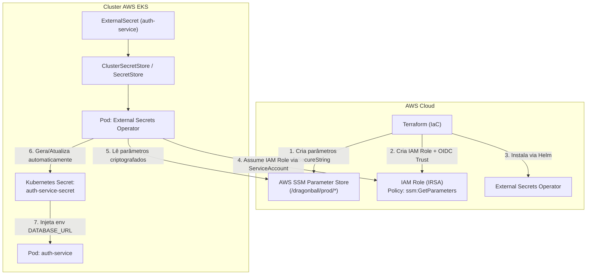

# 📋 Plano de Execução — Opção 1: AWS SSM + External Secrets Operator (ESO) + IRSA

> **Nível de Maturidade:** Enterprise / GitOps Nativo / DevSecOps Avançado ⭐  
> **Objetivo:** Provisionar parâmetros sensíveis criptografados no AWS Systems Manager (SSM Parameter Store) via Terraform e sincronizá-los dinamicamente com o Cluster EKS utilizando o External Secrets Operator (ESO) autenticado via IAM Roles for Service Accounts (IRSA).

---

## 1. Visão Geral da Arquitetura

Neste modelo, nenhum segredo é versionado no Git nem injetado estaticamente no Kubernetes. O cluster EKS possui um operador especializado que consulta o AWS SSM de forma contínua e mantém os `Secrets` nativos do Kubernetes sincronizados.



---

## 2. Análise Técnica: Prós e Contras

| Aspecto | Detalhes |
| :--- | :--- |
| **Segurança (DevSecOps)** | 🟢 **Máxima**. Segredos criptografados via AWS KMS no SSM. Acesso ao SSM restrito via IAM Role temporária (OIDC/IRSA), sem credenciais estáticas (`AWS_ACCESS_KEY_ID`). |
| **Conformidade GitOps** | 🟢 **100% GitOps**. O repositório Git contém apenas a referência abstrata do segredo (`ExternalSecret`), nunca o valor confidencial. |
| **Rotação de Segredos** | 🟢 **Automática**. Se um valor for alterado no AWS SSM, o ESO atualiza o `Secret` no Kubernetes dentro do intervalo configurado (ex: a cada 1 hora). |
| **Consumo de Recursos** | 🟡 Requer ~50MB a 100MB de memória RAM para os pods do operador no nó do EKS. |
| **Complexidade** | 🟡 Média/Alta. Requer configuração de OIDC, IAM Roles, Helm Chart e CRDs (Custom Resource Definitions). |

---

## 3. Roteiro Passo a Passo de Implementação

### Passo 1: Provisionar Parâmetros no AWS SSM (Terraform)
Criar um módulo ou declaração no Terraform para persistir os segredos no SSM:
* `/dragonball/prod/auth-service/db_password` (SecureString)
* `/dragonball/prod/auth-service/database_url` (SecureString montada dinamicamente com o endpoint do RDS)
* `/dragonball/prod/auth-service/admin_key` (SecureString)

```hcl
resource "aws_ssm_parameter" "db_password" {
  name        = "/${var.project_name}/prod/auth-service/db_password"
  description = "Senha do banco de dados RDS PostgreSQL"
  type        = "SecureString"
  value       = var.db_password
}

resource "aws_ssm_parameter" "database_url" {
  name        = "/${var.project_name}/prod/auth-service/database_url"
  description = "URL de conexao completa do PostgreSQL para o auth-service"
  type        = "SecureString"
  value       = "postgres://${module.rds.db_username}:${var.db_password}@${module.rds.db_endpoint}/${module.rds.db_name}?sslmode=require"
}
```

---

### Passo 2: Configurar IAM Role for Service Account (IRSA)
Associar a Service Account do Kubernetes à IAM Role da AWS através do OIDC Provider do EKS:

```hcl
# Policy permitindo leitura no caminho dos parâmetros do projeto
resource "aws_iam_policy" "eso_ssm_policy" {
  name        = "${var.project_name}-eso-ssm-policy"
  description = "Permite ao ESO ler parametros do SSM Parameter Store"

  policy = jsonencode({
    Version = "2012-10-17"
    Statement = [{
      Effect = "Allow"
      Action = [
        "ssm:GetParameter",
        "ssm:GetParameters",
        "ssm:GetParametersByPath"
      ]
      Resource = "arn:aws:ssm:${var.aws_region}:${data.aws_caller_identity.current.account_id}:parameter/${var.project_name}/*"
    }]
  })
}

# IAM Role com Trust Policy para a ServiceAccount do ESO
module "eso_irsa_role" {
  source  = "terraform-aws-modules/iam/aws//modules/iam-role-for-service-accounts-eks"
  version = "~> 5.0"

  role_name                      = "${var.project_name}-external-secrets-role"
  attach_external_secrets_policy = false

  role_policy_arns = {
    ssm_policy = aws_iam_policy.eso_ssm_policy.arn
  }

  oidc_providers = {
    main = {
      provider_arn               = module.eks.oidc_provider_arn
      namespace_service_accounts = ["external-secrets:external-secrets-sa"]
    }
  }
}
```

---

### Passo 3: Instalar o External Secrets Operator via Helm (Terraform)
Adicionar o release do Helm no Terraform para gerenciar a instalação do operador:

```hcl
resource "helm_release" "external_secrets" {
  name             = "external-secrets"
  repository       = "https://charts.external-secrets.io"
  chart            = "external-secrets"
  version          = "0.10.4"
  namespace        = "external-secrets"
  create_namespace = true

  set {
    name  = "serviceAccount.create"
    value = "true"
  }

  set {
    name  = "serviceAccount.name"
    value = "external-secrets-sa"
  }

  set {
    name  = "serviceAccount.annotations.eks\\.amazonaws\\.com/role-arn"
    value = module.eso_irsa_role.iam_role_arn
  }

  depends_on = [module.eks]
}
```

---

### Passo 4: Criar Manifests GitOps (SecretStore & ExternalSecret)
No repositório Git (Kustomize/ArgoCD), criar os manifests que instruem o ESO a buscar os parâmetros do SSM:

1. **`ClusterSecretStore.yml` (Infraestrutura):**
```yaml
apiVersion: external-secrets.io/v1beta1
kind: ClusterSecretStore
metadata:
  name: aws-ssm-store
spec:
  provider:
    aws:
      service: ParameterStore
      region: us-east-2
      auth:
        jwt:
          serviceAccountRef:
            name: external-secrets-sa
            namespace: external-secrets
```

2. **`ExternalSecret.yml` (`gitops/apps/auth-service/base/externalsecret.yml`):**
```yaml
apiVersion: external-secrets.io/v1beta1
kind: ExternalSecret
metadata:
  name: auth-service-secrets
  namespace: toggle-master
spec:
  refreshInterval: 1h
  secretStoreRef:
    name: aws-ssm-store
    kind: ClusterSecretStore
  target:
    name: auth-service-secret
    creationPolicy: Owner
  data:
    - secretKey: DATABASE_URL
      remoteRef:
        key: /dragonball/prod/auth-service/database_url
    - secretKey: API_KEY_ADMIN
      remoteRef:
        key: /dragonball/prod/auth-service/admin_key
```

---

## 4. Roteiro de Validação e Teste

1. **Aplicar o Terraform:**
   ```bash
   terraform apply -auto-approve
   ```
2. **Validar o Operador no EKS:**
   ```bash
   kubectl get pods -n external-secrets
   ```
3. **Validar a Sincronização do Segredo:**
   ```bash
   kubectl get externalsecret -n toggle-master
   kubectl get secret auth-service-secret -n toggle-master -o yaml
   ```
4. **Validar o Pod da Aplicação:**
   ```bash
   kubectl logs -n toggle-master deployment/auth-service
   ```
