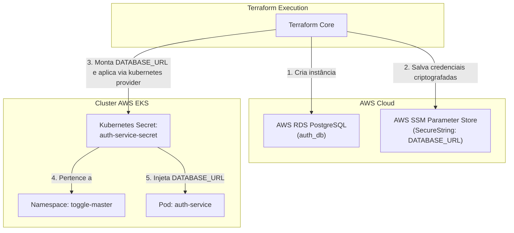

# 📋 Plano de Execução — Opção 2: AWS SSM + Provisionamento Direto via Terraform

> **Nível de Maturidade:** Pragmático / Rápido / Baixa Sobrecarga de Recursos ⚡  
> **Objetivo:** Provisionar os parâmetros sensíveis no AWS Systems Manager (SSM Parameter Store) e usar o próprio provider do Kubernetes no Terraform (`kubernetes_secret`) para injetar os segredos diretamente no cluster EKS no namespace da aplicação.

---

## 1. Visão Geral da Arquitetura

Neste modelo, o Terraform atua como a ponte central: ele gera a infraestrutura AWS (RDS e SSM) e, logo após a inicialização do cluster, utiliza as credenciais de autenticação do EKS para criar diretamente os `Secrets` nativos no Kubernetes.



---

## 2. Análise Técnica: Prós e Contras

| Aspecto | Detalhes |
| :--- | :--- |
| **Simplicidade** | 🟢 **Muito Alta**. Não requer instalação de operadores extras, CRDs complexos ou configuração de IRSA. |
| **Consumo de Recursos (FinOps)** | 🟢 **Zero overhead**. Não gasta CPU nem memória no cluster com pods de operadores de sincronização. |
| **Segurança no Git** | 🟢 **100% Protegido**. O repositório Git não armazena nenhuma senha, pois o secret é criado pelo Terraform diretamente no cluster. |
| **Acoplamento** | 🟡 O ciclo de vida do `Secret` fica atrelado à execução do Terraform. |
| **Rotação de Segredos** | 🟡 Para rotacionar ou atualizar um segredo alterado no SSM, é necessário executar um `terraform apply`. |

---

## 3. Roteiro Passo a Passo de Implementação

### Passo 1: Criar os Parâmetros no AWS SSM (Terraform)
Armazenar no SSM os valores sensíveis gerados e utilizados pela infraestrutura:

```hcl
# Parameter Store para a senha mestre
resource "aws_ssm_parameter" "db_password" {
  name        = "/${var.project_name}/prod/auth-service/db_password"
  description = "Senha master do banco de dados RDS PostgreSQL"
  type        = "SecureString"
  value       = var.db_password
}

# Parameter Store para a Connection String completa da aplicacao
resource "aws_ssm_parameter" "database_url" {
  name        = "/${var.project_name}/prod/auth-service/database_url"
  description = "URL completa de conexao com SSL obrigatorio para o auth-service"
  type        = "SecureString"
  value       = "postgres://${module.rds.db_username}:${var.db_password}@${module.rds.db_endpoint}/${module.rds.db_name}?sslmode=require"
}

# Parameter Store para a Chave de Administrador padrao
resource "aws_ssm_parameter" "admin_api_key" {
  name        = "/${var.project_name}/prod/auth-service/admin_api_key"
  description = "API Key padrao de avaliacao/administracao da FIAP"
  type        = "SecureString"
  value       = "fiap-secret-key-123456"
}
```

---

### Passo 2: Criar o Kubernetes Secret no Namespace do Projeto (Terraform)
Utilizar o provider `kubernetes` configurado no [`providers.tf`](file:///home/brsantos/projects/fiap/FASE3/terraform/providers.tf) para injetar o segredo:

```hcl
# Garante que o namespace existe antes de criar o secret
resource "kubernetes_namespace" "toggle_master" {
  metadata {
    name = "toggle-master"
  }

  depends_on = [module.eks]
}

# Cria o Secret consumido pelo Deployment do auth-service
resource "kubernetes_secret" "auth_service_secret" {
  metadata {
    name      = "auth-service-secret"
    namespace = kubernetes_namespace.toggle_master.metadata[0].name
  }

  data = {
    DATABASE_URL  = aws_ssm_parameter.database_url.value
    API_KEY_ADMIN = aws_ssm_parameter.admin_api_key.value
  }

  type = "Opaque"

  depends_on = [
    module.eks,
    module.rds,
    aws_ssm_parameter.database_url
  ]
}
```

---

### Passo 3: Limpeza dos Manifests GitOps (Kustomize / ArgoCD)
No repositório Git, removemos qualquer arquivo `secret.yml` estático para garantir conformidade DevSecOps:

1. **Remover** o arquivo `gitops/apps/auth-service/base/secret.yml`.
2. **Atualizar** o `gitops/apps/auth-service/base/kustomization.yml`:
   ```yaml
   apiVersion: kustomize.config.k8s.io/v1beta1
   kind: Kustomization

   resources:
     - deployment.yml
     - service.yml
     - hpa.yml
   # secret.yml removido pois o secret e provisionado de forma segura pelo Terraform
   ```
3. O `deployment.yml` continua referenciando o secret normalmente via `secretKeyRef`:
   ```yaml
   env:
     - name: DATABASE_URL
       valueFrom:
         secretKeyRef:
           name: auth-service-secret
           key: DATABASE_URL
   ```

---

## 4. Roteiro de Validação e Teste

1. **Aplicar as alterações no Terraform:**
   ```bash
   cd terraform
   terraform apply -auto-approve
   ```
2. **Conferir os parâmetros criados no AWS SSM:**
   ```bash
   aws ssm get-parameters-by-path --path "/dragonball/prod/auth-service" --with-decryption --region us-east-2
   ```
3. **Validar se o Secret foi criado no Cluster EKS:**
   ```bash
   kubectl get secret auth-service-secret -n toggle-master -o yaml
   ```
4. **Verificar os Logs do Microsserviço:**
   ```bash
   kubectl logs -n toggle-master deployment/auth-service
   ```
   *Resultado esperado:* Conexão bem-sucedida com o RDS PostgreSQL e migração automática executada.
