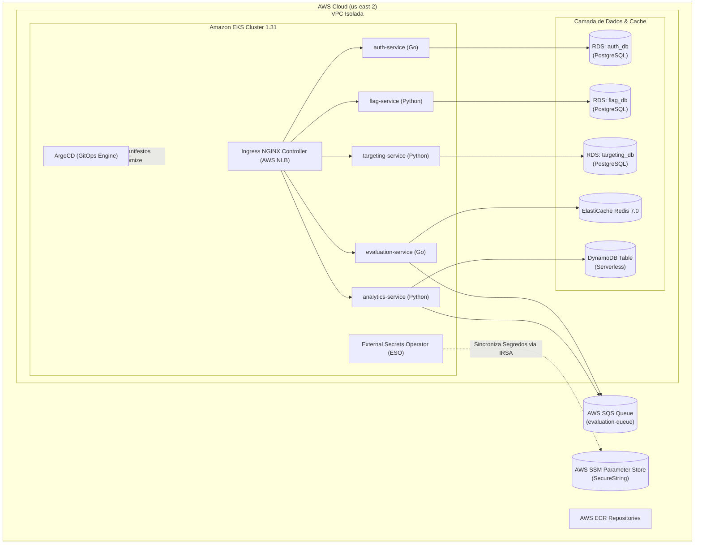
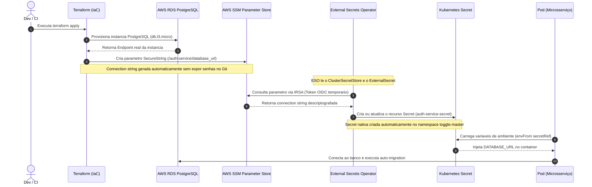

# 🚀 ToggleMaster — FIAP Postech (Tech Challenge Fase 3)

---

## 📌 1. Visão Geral da Arquitetura

O **ToggleMaster** é uma plataforma distribuída de gerenciamento e avaliação de Feature Flags em tempo real, composta por **5 microsserviços especializados**:



---

## 🧩 2. Os 5 Microsserviços do Projeto

| Microsserviço | Linguagem | Banco / Integração | Responsabilidade |
| :--- | :--- | :--- | :--- |
| **`auth-service`** | Go (Gin) | RDS PostgreSQL (`auth_db`) | Gerenciamento de chaves de API (`api_keys`) e validação de tokens. |
| **`flag-service`** | Python (Flask) | RDS PostgreSQL (`flag_db`) | CRUD de Feature Flags e status de ativação/desativação. |
| **`targeting-service`**| Python (Flask) | RDS PostgreSQL (`targeting_db`) | Regras de segmentação de público e targeting por atributos. |
| **`evaluation-service`**| Go | Redis + SQS + Flag/Targeting | Motor de avaliação de regras de alta performance com cache L1 e eventos assíncronos. |
| **`analytics-service`** | Python | AWS SQS + DynamoDB | Consumidor assíncrono que persiste métricas e eventos de avaliação no NoSQL. |

---

## 🔐 3. Gestão Segura de Segredos (AWS SSM + ESO + IRSA)

Adotamos a política de **Segurança por Design e Automação Total**. Nenhuma credencial trafega em texto plano no Git e nenhuma senha é criada manualmente no console da AWS.

### 🔄 Diagrama de Sequência do Fluxo de Segredos:



### 🧱 Os Componentes Envolvidos:
1. **AWS SSM Parameter Store:** Armazena parâmetros confidenciais criptografados (`SecureString`).
2. **IRSA (IAM Roles for Service Accounts):** Concede permissões granulares aos Pods do Kubernetes via tokens JWT OIDC temporários, eliminando chaves estáticas (`AWS_ACCESS_KEY_ID`).
3. **`ClusterSecretStore` ([`cluster-secret-store.yml`](gitops/infrastructure/base/cluster-secret-store.yml)):** Configura o conector global do Kubernetes com o Parameter Store da AWS.
4. **`ExternalSecret` ([`externalsecret.yml`](gitops/apps/auth-service/base/externalsecret.yml)):** Mapeia os parâmetros da AWS para Secrets nativas do Kubernetes.
5. **`Secret` Nativa:** Injetada nos Pods via `envFrom: secretRef` de forma totalmente transparente.

---

## 🏗️ 4. Infraestrutura como Código (Terraform Modular)

Toda a infraestrutura é provisionada de forma 100% declarativa, reproduzível e modular:

```text
terraform/
├── main.tf                     # Camada de composição limpa dos módulos
├── variables.tf / outputs.tf   # Declaração de entradas e saídas
├── backend.tf                  # Estado remoto no AWS S3 com Lock no DynamoDB
└── modules/
    ├── network-vpc/            # VPC, Subnets Públicas/Privadas, NAT Gateway e IGW
    ├── eks/                    # Cluster Amazon EKS 1.31 com Managed Node Groups
    ├── rds/                    # 3x Instâncias dedicadas RDS PostgreSQL
    ├── redis/                  # Cluster AWS ElastiCache Redis 7.0
    ├── dynamodb/               # Tabela NoSQL Serverless (PAY_PER_REQUEST)
    ├── sqs/                    # Fila AWS SQS para eventos
    ├── ssm-parameters/         # Parâmetros e connection strings criptografadas
    ├── iam-irsa/               # IAM Roles com OIDC para pods e operadores
    ├── ingress-nginx/          # Ingress Controller integrado a AWS NLB
    ├── external-secrets/       # Helm Release do ESO
    └── argocd/                 # Helm Release do ArgoCD
```

---

## 🐙 5. GitOps com Kustomize & ArgoCD

A entrega contínua segue os princípios de **GitOps**, onde o estado do cluster é uma representação fiel do repositório Git.

### 📂 Estrutura Semântica do GitOps (`gitops/`):

```text
gitops/
├── bootstrap/
│   └── argocd/
│       └── app-prod.yml        # 🚀 Root Application declarativa do ArgoCD
├── infrastructure/             # 🌐 Manifestos globais (Namespace, Ingress, ClusterSecretStore)
│   ├── base/
│   └── overlays/prod/
├── apps/                       # 📦 Manifestos individuais de cada microsserviço
│   ├── auth-service/           # (Deployment, Service, ExternalSecret, ConfigMap)
│   ├── flag-service/
│   ├── targeting-service/
│   ├── evaluation-service/
│   └── analytics-service/
└── overlays/
    └── prod/                   # 🎯 Kustomization raiz de produção
        └── kustomization.yml
```

* **ArgoCD:** Configurado como serviço `ClusterIP` com reconciliação acelerada a cada **30 segundos** (`timeout.reconciliation: "30s"`).
* **Ingress NGINX:** Roteia tráfego externo para os serviços através de um Network Load Balancer (NLB) com `rewrite-target`.

---

## 🛡️ 6. Pipeline Multi-Stage DevSecOps (GitHub Actions)

Cada microsserviço possui uma pipeline automatizada (`.github/workflows/ci-*.yml`) estruturada em **6 estágios com Quality Gates rigorosos**:

```text
[Stage 1: Testes & Linters] ──┐
[Stage 1: SAST (Horusec)]    ──┼─► [Stage 2: Docker Build & Trivy Image Scan] ─► [Stage 3: Push ECR] ─► [Stage 4: GitOps Sync] ─► [Stage 5: ArgoCD Rollout]
[Stage 1: SCA (Trivy FS)]    ──┘
```

1. **Stage 1 (Paralelo):**
   - **Testes Unitários:** `go test` / `pytest` com mocks robustos de banco e AWS.
   - **Linters:** `golangci-lint` / `flake8`.
   - **SAST (Static Application Security Testing):** `Horusec CLI` analisando código estático e bloqueando vulnerabilidades.
   - **SCA (Software Composition Analysis):** `Trivy FS` analisando dependências (`go.mod`, `requirements.txt`) e falhando em severidades `CRITICAL,HIGH`.
2. **Stage 2 (Fan-In):**
   - Construção da imagem Docker local e varredura com `Trivy Image Scan` contra vulnerabilidades de imagem base.
3. **Stage 3:** Push autenticado da imagem no **AWS ECR** com a tag do commit.
4. **Stage 4:** Atualização automática da imagem no manifesto `kustomization.yml` do GitOps com rebase resiliente.
5. **Stage 5:** O ArgoCD detecta a atualização e executa o rollout sincronizado no EKS.
6. **Stage 6:** Publicação do resumo consolidado do Quality Gate no GitHub Step Summary.

> 💡 **Pipeline Orquestradora:** O workflow [`.github/workflows/deploy-all.yml`](.github/workflows/deploy-all.yml) permite disparar o build e deploy dos 5 microsserviços simultaneamente com apenas 1 clique via `workflow_dispatch`.

---

## ⚡ 7. Guia Rápido de Execução e Comandos Úteis

### 🔹 1. Acesso ao Painel do ArgoCD:
```bash
# Iniciar o port-forward para o painel do ArgoCD:
kubectl port-forward svc/argocd-server -n argocd 8080:443

# Obter a senha inicial do usuário 'admin':
kubectl -n argocd get secret argocd-initial-admin-secret -o jsonpath='{.data.password}' | base64 -d; echo
# Acesse em: https://localhost:8080
```

### 🔹 2. Validar Status do Kubernetes & Secrets:
```bash
# Verificar se todos os 5 pods estão 1/1 Running:
kubectl get pods -n toggle-master

# Verificar se os ExternalSecrets sincronizaram com o AWS SSM:
kubectl get externalsecrets -n toggle-master

# Verificar as Secrets nativas criadas:
kubectl get secrets -n toggle-master
```

### 🔹 3. Testar Endpoints via Ingress NLB:
```bash
# Obter o Hostname do Ingress NLB:
export INGRESS_HOST=$(kubectl get svc ingress-nginx-controller -n ingress-nginx -o jsonpath='{.status.loadBalancer.ingress[0].hostname}')

# Testar a saúde de cada microsserviço:
curl -i http://$INGRESS_HOST/auth/health
curl -i http://$INGRESS_HOST/flags/health
curl -i http://$INGRESS_HOST/targeting/health
curl -i http://$INGRESS_HOST/evaluate-api/health
curl -i http://$INGRESS_HOST/analytics-api/health
```

---

## 📚 8. Documentos de Apoio Adicionais

- 📋 [Diagrama de Sequência & Guia de Segredos](DIAGRAMA_SEQUENCIA_SECRETS.md)
- 💰 [Relatório de Estimativa de Custos AWS (FinOps)](IAPLANOS/ESTIMATIVA_CUSTOS_AWS.md)
- 🎬 [Roteiro Detalhado de Gravação do Vídeo](IAPLANOS/ROTEIRO_GRAVACAO_VIDEO.md)
- 🧠 [Registro Contínuo de Decisões e Contexto do Projeto](ANNOTATIONS/CONTEXTO_PROJETO.md)

